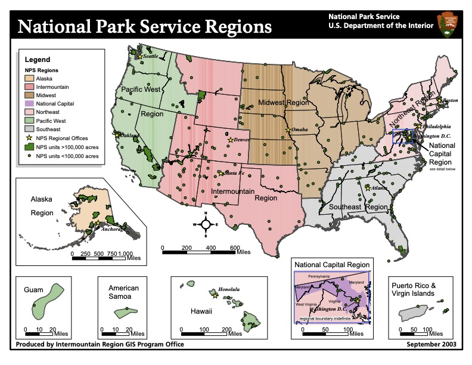

```{r setup, include=FALSE}
knitr::opts_chunk$set(echo = TRUE)

library(dplyr)
library(tidyr)
library(knitr)
library(stringr)
library(readr)

library(ggplot2)
library(httr)
library(jsonlite)
library(sf)
library(scales)
library(usmap)
library(geosphere)

library(TSP)
library(cluster)

library(gridExtra)
library(gganimate)
library(tinytex)
```

<div id="data_exploration">

# Getting Familiar with our Data!

We first need to load the data set I found from [data.world](https://data.world/inform8n/us-national-parks-visitation-1904-2016-with-boundaries/workspace/file?filename=All+National+Parks+Visitation+1904-2016.csv).

```{r Add National Parks Visitor Data Set}

  ## Getting my Data Set
data <- read.csv("assets/Data Sources/US_NPS_Visitation/original/All National Parks Visitation 1904-2016.csv")

```

First, I would like to understand the structure of this data set.

```{r Checking Structure, include=TRUE, eval=FALSE}

  ## Exploring my Data Set
head(data, 3)
summary(data)

```

This set has 18 columns consisting of 17 'character' variables and one 'int' variable. The various columns contain information like park name, region, state, type of park, and number of visitors. Each observation (or row) is a different park by year.

# The Problem

After seeing the structure of this set, I think the first question I would like to answer is which parks I should plan to visit based solely on popularity by number of visitors.

## Exploratory Analysis

First, Let's clean some things up by removing unnecessary columns for my analysis.

```{r Data Manipulation to check for problems}

  ## Select fewer columns
data_clean <- select(data, Region:YearRaw)

 ## Check for missing or problem values
year_list <-data_clean %>% count(data_clean$YearRaw)
## head(year_list,4)
## tail(year_list,2)
## sum(is.na(data_clean$visitors))

```

After looking at the smaller subset of data, the 'yearraw' column has a 'Total' section that will cause issues during analysis. I will also convert it to a numeric value rather than character value. In addition, the 'visitors' column has 4 values that are not available. I will remove those observations to streamline my exploration.

```{r Clearing Problem observations}

  ## Removing observations with NA's
data_clean <- na.omit(data_clean)


  ## Subset the data
data_totals <- subset(data_clean, YearRaw == "Total")
data_clean <- subset(data_clean, YearRaw != "Total")
data_clean$YearRaw <- as.numeric(data_clean$YearRaw)
```

</div>
<div id="visitation_trends">

## Visitation Trends

I want to understand the trend for all National park visitation over the years before sub-setting to smaller groups. This will help me compare national trends to the trends of different areas.

------------------------------------------------------------------------

```{r Create a basic Line Plot of Total Visitation, echo=FALSE, out.width= 400}

sum_by_year <- aggregate(Visitors ~ YearRaw, data_clean, sum) 

p1 <- ggplot(data = sum_by_year, aes(x = YearRaw, y = Visitors)) +
  geom_line() +
  scale_y_continuous(labels = label_number()) +
  theme_minimal() +
  labs(title = "Total National Park Visitation per Year (1904-2016)",
       x = "Year", y = "Total Visitors (in Millions)")
p1

```

------------------------------------------------------------------------

This plot shows how visitor numbers have changed over time. It appears there is an overall increasing trend in the number of visitors, which could be attributed to a variety of factors that would require a deeper dive.

{width=650 height=600}

\newpage

## Regions

The data set is subdivided into regions as shown in the info graphic above.

I am only interested in regions near me. So I am going to look at the region I am in as well as surrounding regions. I need to group and filter my data set to get the appropriate observations.

```{r Data Manipulation for grouping by region}

  ## group and filter by region
region_total <- data_clean %>%
  filter(Region == "PW" | Region == "IM" |
         Region == "MW") %>%
  group_by(YearRaw, Region) %>% 
  summarise(Total = sum(Visitors), .groups = "rowwise") %>%
  na.omit()

```

------------------------------------------------------------------------

```{r Plot 2, echo=FALSE, warning=FALSE}

p2 <- ggplot(region_total, aes(x = YearRaw, y = Total, group = Region, color = Region)) +
  geom_line() +
  scale_y_continuous(labels = label_number()) +
  theme_minimal() +
  labs(title = "Total National Park Visitation per Year (1904-2016)", 
       x = NULL,
       y = "Total Visitors (in Millions)") +
  facet_wrap(~ Region) +
  theme(axis.text.x = element_blank())

p2

```

------------------------------------------------------------------------

These plots show that Intermountain and Pacific West regions have seen the steepest increases in visits. I will focus my attention on these two regions.

</div>
<div id="visitation_trends_states">

## States

In order to show total visitation by state I need to filter and group my data set.

```{r Data Manipulation for grouping by State, echo=TRUE}
  ## Group by State
state_data <- data_clean %>%
  group_by(State) %>%
  summarise(Total = sum(Visitors)) %>%
  filter(State %in% c("WA", "OR", "CA", "MT", "WY", 
                      "CO", "UT", "NV", "ND", "SD", 
                      "NE", "ID", "AZ", "NM"))
```

Next, I need to add location data in order to create a heat map of my new data. I can use the 'usmap' package to create an interesting plot.

```{r Get States Map}

  ## Get the states map data from usmap
states_map <- usmap::us_map(regions = "states") %>%
  filter(abbr %in% c("WA", "OR", "CA", "MT", "WY", "CO", 
                     "UT", "NV", "ND", "SD", "NE", "ID", 
                     "AZ", "NM"))

  ## Merge visitor data with map data
merged_data <- merge(states_map, state_data, by.x = "abbr", 
                     by.y = "State", all.x = TRUE)

```

Now I can prepare my base layer for adding multiple data visualizations.

```{r Create Base Map for Map Plot}

p3 <- ggplot() +
  geom_sf(data = merged_data, aes(fill = Total), color = "black") +
  scale_fill_continuous(
    labels = scales::comma, 
    low = "white", 
    high = "red", 
    name = "All Time Visits", 
    na.value = "gray"
  ) +
  theme_void() +
  labs(title = "Heatmap of Total National Park Visits",
       subtitle = "by Selected Western US States") +
  theme(
    legend.position = "right",
    legend.title = element_text(size = 14, face = "bold"), 
    legend.text = element_text(size = 12), 
    legend.key.size = unit(1.5, "cm"),  
    plot.title = element_text(size = 16, face = "bold", hjust = 0.5),
    plot.subtitle = element_text(size = 14, hjust = 0.5),
  )

print(p3)
```

\newpage

This heat map shows which states have the most visitors. Based on the results, I will pick the top parks in California, Wyoming, and Washington. I'd like to start thinking about weighing the distance from my home and the number of visitors to see if it can help me decide.

</div>
<div id="visitation_trends_parks">

I will need to find another data set to add latitude and longitude values for the top parks. and add that information into my top parks data I started preparing below.

```{r Filter and group by Park}

top_parks <- data_clean %>%
  group_by(Unit.Name, State) %>%
  summarise(Total = sum(Visitors), .groups = "rowwise") %>%
  arrange(desc(Total)) %>%
  filter(State %in% c("WA", "OR", "CA", "MT", "WY", 
                      "CO", "UT", "NV", "ND", "SD", 
                      "NE", "ID", "AZ", "NM"))

```

I was able to compile the coordinates for a number of the most visited parks. I need to create a data frame before I can merge my top parks data with these locations.

```{r Create new data frame from Text file, warning=FALSE}

  ## Creating a new data frame from the coordinates I compiled
geo_data <- read_csv("~/Documents/GitHub/National_Parks_Project/assets/Data Sources/geo_data_processed.txt", col_types = cols(Lat = col_number(),
    Long = col_number()))

```

```{r Merging new coordinates with top_parks Data Frame}

 ## adding coordinates to my list of top parks
top_parks_merged <- merge(top_parks, geo_data, 
                     by.x = "Unit.Name", by.y = "Park Name")

  ## rearranging columns to make manipulation easier
top_parks_rearranged <- select(top_parks_merged, Unit.Name, State.x, Total, Longitude, Latitude)

```

After Merging, I now need to convert the Longitude and Latitude to the 'usmap' coordinate system in order to map locations onto my base layer.

```{r Coordinate conversion for usmap, warning = FALSE}

states_to_include <- c("WA", "OR", "CA", "MT", "WY", "CO", "UT", "NV", "ND", "SD", "NE", "ID", "AZ", "NM")

states_map <- usmap::us_map(regions = "states") %>%
  filter(abbr %in% states_to_include)

top_parks_rearranged_sf <- st_as_sf(top_parks_rearranged, 
                                    coords = c("Longitude", "Latitude"), 
                                    crs = 4326)

```

Now I can create a plot to summarize my findings.

------------------------------------------------------------------------

```{r bubble Plot}

base_map <- ggplot() +
  geom_sf(data = states_map, fill = "white", color = "black" ) +
  theme_minimal() +
  labs(title = "Western United States National Parks",
       subtitle = "All Time Visitation")+
  theme(plot.title = element_text(face = "bold", size = 18, hjust = 0.5),
        plot.subtitle = element_text(size = 14, hjust = 0.5),
        plot.caption = element_text(size = 10, hjust = 1),
        panel.grid.major = element_blank(),
        panel.grid.minor = element_blank())


bubble_plot <- base_map +
  geom_sf(data = top_parks_rearranged_sf, aes(size = Total), fill = "dodgerblue3", color = "blue", alpha = 0.6, shape = 21) + 
  scale_size_continuous(name = "Total Visitors", 
                        labels = scales::label_number(big.mark = ","),
                        transform = "sqrt") +
  theme(legend.position = "right",
        legend.title = element_text(face = "bold", size = 12),
        legend.text = element_text(size = 10))

print(bubble_plot)
```

------------------------------------------------------------------------

Now that I have a better idea of where specific top parks are I can start narrowing my search. I think I should consider distance from my home.

</div>
<div id="distance_analysis">

## Distance Analysis

I will start by loading and converting my hometown coordinates to the 'usmap' coordinate system.

```{r Hometown Coordinates, warning = FALSE}

  ## Coordinates for Helena, Montana
helena_coords <- data.frame(Latitude = 46.5891, Longitude = -112.0372)

helena_coords_transformed_sf <- st_as_sf(helena_coords, 
                                    coords = c("Longitude", "Latitude"), 
                                    crs = 4326)

top_parks_merged_sf <- st_as_sf(top_parks_merged, 
                                    coords = c("Longitude", "Latitude"), 
                                    crs = 4326)

```

```{r route coords}

  ## Function for getting route coordinates for each park
get_route <- function(start, end) {
  url <- paste0(
    "http://router.project-osrm.org/route/v1/driving/",
    start["lon"], ",", start["lat"], ";",
    end["Longitude"], ",", end["Latitude"],
    "?overview=full&geometries=geojson"
  )
  
  response <- httr::GET(url)
  route <- jsonlite::fromJSON(content(response, "text", encoding = "UTF-8"))
  route_coords <- route$routes$geometry$coordinates[[1]]
  route_coords_df <- data.frame(
    lon = route_coords[, 1],
    lat = route_coords[, 2]
  )
  return(route_coords_df)
}

  ## Helena (Start Location) coordinates
start <- c(lat = 46.5891, lon = -112.0372)

routes_list <- lapply(1:nrow(top_parks_merged), function(i) {
  end <- top_parks_merged[i, ]
  route_df <- get_route(start, end)
  route_df$park <- top_parks_merged$Unit.Name[i]
  return(route_df)
})

all_routes <- do.call(rbind, routes_list)

```


```{r conversions}

# Conversion factor from meters to miles
meters_to_miles <- 1609.34

# Function to calculate total distance of a route in miles
calculate_total_distance_miles <- function(df) {
  # Ensure that lon and lat columns are numeric
  df$lon <- as.numeric(df$lon)
  df$lat <- as.numeric(df$lat)
  
  # Compute distances between consecutive points
  coords <- as.matrix(df[, c("lon", "lat")])
  distances <- distVincentySphere(coords[1:(nrow(coords) - 1), ], coords[2:nrow(coords), ])
  
  # Sum distances and convert to miles
  total_distance_meters <- sum(distances)
  total_distance_miles <- total_distance_meters / meters_to_miles
  return(total_distance_miles)
}

# Apply the function to each data frame in routes_list
total_distances_miles <- sapply(routes_list, calculate_total_distance_miles)

# Add total distances (in miles) to each data frame in routes_list
routes_list_with_distance_miles <- Map(function(df, dist) {
  df$total_distance_miles <- dist
  return(df)
}, routes_list, total_distances_miles)

all_routes <- bind_rows(routes_list_with_distance_miles)

```


```{r plot routes}
route_sf <- st_as_sf(all_routes, coords = c("lon", "lat"), crs = 4326)

# Add a column for distance categories for better visualization
all_routes$distance_category <- cut(
  all_routes$total_distance_miles,
  breaks = c(0, 10, 50, 100, 200, Inf), 
  labels = c("0-10 miles", "10-50 miles", "50-100 miles", "100-200 miles", "200+ miles")
)

p <- base_map +
  geom_sf(data = route_sf, aes(color = total_distance_miles), size = 0.1) +
  labs(title = "Routes from Helena, MT to National Parks",
       subtitle = "Distances visualized with a color gradient",
       x = "Longitude", y = "Latitude",
       color = "Distance (miles)") +
  theme_minimal() +
  theme(
    plot.title = element_text(face = "bold", size = 16, hjust = 0.5, vjust = 0.5),
    plot.subtitle = element_text(size = 12, hjust = 0.5),
    legend.title = element_text(size = 12),
    legend.text = element_text(size = 10)
  ) +
  scale_color_viridis_c()

print(p)
```

------------------------------------------------------------------------

</div>
<div id="cluster_parks">

# Re-Defining the problem

After seeing this visualization, I want to pivot to a new problem. How I can optimize seeing multiple parks per trip rather than trying to choose one park. There are too many nearby! I need to use a clustering model to group the parks by looking at their distances from each other. To do this I need to use a hierarchical cluster function.

```{r Clustering}

  ## Perform a hierarchical clustering

top_parks_cluster <- top_parks_merged

# Function to calculate approximate distance between two points
calculate_distance <- function(lat1, lon1, lat2, lon2) {
  distVincentySphere(c(lon1, lat1), c(lon2, lat2)) / 1000  # Convert meters to kilometers
}

# Create a distance matrix
num_parks <- nrow(top_parks_merged)
distance_matrix <- matrix(0, nrow = num_parks, ncol = num_parks, dimnames = list(top_parks_cluster$name, top_parks_cluster$name))

for (i in 1:num_parks) {
  for (j in 1:num_parks) {
    if (i != j) {
      lat1 <- top_parks_cluster$Latitude[i]
      lon1 <- top_parks_cluster$Longitude[i]
      lat2 <- top_parks_cluster$Latitude[j]
      lon2 <- top_parks_cluster$Longitude[j]
      distance <- calculate_distance(lat1, lon1, lat2, lon2)
      distance_matrix[i, j] <- distance
    }
  }
}

# Convert the distance matrix to a data frame
distance_df <- as.data.frame(as.table(distance_matrix))
names(distance_df) <- c("from", "to", "distance_km")
  
  ## Creating distance matrix
dist_matrix <- dist(top_parks_cluster[,c('Longitude', 'Latitude')])
clusters <- hclust(dist_matrix)

  ## Split into clusters of parks
park_clusters <- cutree(clusters, k = 5)
top_parks_cluster$cluster <- park_clusters

```

\newpage

With my new set of clustered parks, I want to see how the clusters worked out.

------------------------------------------------------------------------

```{r Plot 7, echo=FALSE}

top_parks_cluster_sf <- st_as_sf(top_parks_cluster, coords = c("Longitude", "Latitude"), crs = 4326)

p7 <- base_map +
  geom_sf(data = top_parks_cluster_sf, aes(color = factor(cluster)), size = 2, alpha = 0.9) +
  scale_color_brewer(palette = "Set1") +
  labs(title = "Cluster Analysis of National Parks", 
       color = "Cluster") +
  theme_minimal() +
  coord_sf() +
  theme(legend.position = "right",
        legend.title = element_text(size = 16, face = "bold"), 
        legend.text = element_text(size = 14),
        legend.key.size = unit(1, "cm"),
        plot.title = element_text(size = 16, face = "bold", hjust = 0.5),
        plot.subtitle = element_text(size = 12, hjust = 0.5),
        panel.grid.major = element_blank(),
        panel.grid.minor = element_blank(),
        axis.ticks = element_blank(),
        axis.text.x = element_blank(),
        axis.text.y = element_blank())

p7

```

------------------------------------------------------------------------

</div>
<div id="cluster_parks_tsp">

 Now I want to know what the most efficient way to drive from park to park is so I will use the Traveling Salesman Problem (TSP). The TSP finds shortest possible route that visits each city exactly once and returns to the original city.

```{r TSP}

  ## Initialize an empty list to store results
tsp_results <- list()

  ## Loop through each cluster
for (i in 1:max(top_parks_cluster$cluster)) {
    ## Subset parks for the current cluster
  cluster_parks <- top_parks_cluster[top_parks_cluster$cluster == i, ]
  
    ## Calculate the distance matrix for the current cluster
  dist_matrix <- as.dist(distm(cluster_parks[, c("Longitude", "Latitude")], 
                               cluster_parks[, c("Longitude", "Latitude")], 
                               fun = distHaversine))
  
    ## Solve the TSP problem using the nearest neighbor heuristic
  tsp_solution <- solve_TSP(TSP(dist_matrix), method = "nearest_insertion")
  
    ## Solution List
  tsp_results[[paste("Cluster", i)]] <- tsp_solution
}

```

Now that I have the results, I can visualize what the optimal route is. In order to do that, I want to plot them all on the same map which will require creating a function to compile all the data points into one table.

```{r A Function to create the Segments of the Traveling Sales Person Model}

  ## Function to create segments from the TSP solution
get_tsp_segments <- function(cluster_number, top_parks_cluster, tsp_results) {
  
  ## Filter the parks by the selected cluster
  selected_cluster <- filter(top_parks_cluster, cluster == cluster_number)
  
  ## Retrieve the TSP order for the cluster
  tsp_order <- tsp_results[[paste("Cluster", cluster_number)]]
  print(tsp_order)
  tsp_solution_order <- TOUR(tsp_order)
  
  ## Order the parks according to the TSP solution
  ordered_cluster <- selected_cluster[tsp_solution_order, ]
  
  ## Close the loop by returning to the starting point
  ordered_cluster <- rbind(ordered_cluster, ordered_cluster[1, ])
  
  ## Create segments for each leg of the TSP path
  segments <- data.frame(cluster = cluster_number,
                         x = ordered_cluster$Longitude[-nrow(ordered_cluster)], 
                         y = ordered_cluster$Latitude[-nrow(ordered_cluster)], 
                         xend = ordered_cluster$Longitude[-1], 
                         yend = ordered_cluster$Latitude[-1]
                         )
  
  return(segments)
}

  ## Call the function
all_segments <- lapply(1:max(top_parks_cluster$cluster), function(cluster_num) {
  get_tsp_segments(cluster_num, top_parks_cluster, tsp_results)
})

## Combine all segments into one data frame
all_segments_df <- do.call(rbind, all_segments)


```


```{r A function to get the route coordinates from OSRM}

# Function to get route coordinates from OSRM
get_route_osrm <- function(start_lon, start_lat, end_lon, end_lat) {
  url <- paste0(
    "http://router.project-osrm.org/route/v1/driving/",
    start_lon, ",", start_lat, ";", 
    end_lon, ",", end_lat, 
    "?overview=full&geometries=geojson"
  )
  
  response <- GET(url)
  route <- fromJSON(content(response, "text", encoding = "UTF-8"))
  
  route_coords <- route$routes$geometry$coordinates[[1]]
  route_coords_df <- data.frame(
    lon = route_coords[, 1],
    lat = route_coords[, 2]
  )
  return(route_coords_df)
}

# Apply the function to each row in the data frame
routes_list_cluster <- lapply(1:nrow(all_segments_df), function(i) {
  start_lon <- all_segments_df$x[i]
  start_lat <- all_segments_df$y[i]
  end_lon <- all_segments_df$xend[i]
  end_lat <- all_segments_df$yend[i]
  
  route <- get_route_osrm(start_lon, start_lat, end_lon, end_lat)
  
  route_df <- data.frame(id = i, cluster =all_segments_df$cluster[i], route)
  
  return(route_df)
})

# Combine all route data frames into one
all_cluster_routes_df <- do.call(rbind, routes_list_cluster)

# Create an sf object from the combined data frame
routes_sf <- st_as_sf(all_cluster_routes_df, coords = c("lon", "lat"), crs = 4326, agr = "constant")

routes_sf_lines <- routes_sf %>%
  group_by(id, cluster) %>%
  summarize(geometry = st_combine(geometry)) %>%
  st_cast("LINESTRING")

```


\newpage

------------------------------------------------------------------------

```{r Plot 8, echo=FALSE}

# Create the plot
p8 <- base_map +
  geom_sf(data = routes_sf_lines, 
          color = "black", 
          size = 1,  
          linetype = "solid", 
          arrow = arrow(type = "open", length = unit(0.02, "inches"))) + 
  geom_sf(data = routes_sf_lines, 
          aes(color = as.factor(cluster)), 
          size = 0.5, 
          linetype = "solid", 
          arrow = arrow(type = "open", length = unit(0.015, "inches"))) + 
  scale_color_brewer(palette = "Set1") +
  labs(title = "Traveling Salesman Route Optimization",
       subtitle = "Visiting Clustered Parks",
       color = "Cluster") +
  theme_minimal(base_size = 14) + 
  theme(legend.position = "right",
        legend.title = element_text(size = 16, face = "bold"),
        legend.text = element_text(size = 12),
        legend.key.size = unit( 1, "cm"),
        plot.title = element_text(size = 16, face = "bold", hjust = 0.5),
        plot.subtitle = element_text(size = 12, hjust = 0.5),
        panel.grid.major = element_blank(),
        panel.grid.minor = element_blank(),
        axis.ticks = element_blank(),
        axis.text.x = element_blank(),
        axis.text.y = element_blank(),
        panel.background = element_rect(fill = "white", color = "white")) + 
  coord_sf()  

# Print the plot
print(p8)

```

------------------------------------------------------------------------

</div>
<div id="subcluster_parks">

```{r more TSP}

# Function to calculate approximate distance between two points
calculate_distance <- function(lat1, lon1, lat2, lon2) {
  distVincentySphere(c(lon1, lat1), c(lon2, lat2)) / 1000  # Convert meters to kilometers
}

perform_hierarchical_clustering <- function(df) {
  num_parks <- nrow(df)

  # Create an empty distance matrix
  distance_matrix <- matrix(0, nrow = num_parks, ncol = num_parks, 
                            dimnames = list(1:num_parks, 1:num_parks))
  
  # Populate the distance matrix
  for (i in 1:num_parks) {
    for (j in 1:num_parks) {
      if (i != j) {
        lat1 <- df$Latitude[i]
        lon1 <- df$Longitude[i]
        lat2 <- df$Latitude[j]
        lon2 <- df$Longitude[j]
        distance <- calculate_distance(lat1, lon1, lat2, lon2)
        distance_matrix[i, j] <- distance
      }
    }
  }
  
# Convert the distance matrix to a dist object for hierarchical clustering
  dist_matrix <- as.dist(distance_matrix)
  
  # Perform hierarchical clustering using Ward's method
  hc <- hclust(dist_matrix, method = "ward.D2")
  
  # Determine the number of clusters (example: sqrt of the number of rows)
  num_clusters <- max(nrow(df)/5, 1)
  
  # Cut the dendrogram to create the clusters
  clusters <- cutree(hc, k = num_clusters)
  
    # Add cluster assignments to the original data frame
  df$subcluster <- clusters

  return(list(hc = hc, clusters = clusters, df_with_clusters = df))
}

# Initialize a list to store results for each cluster
cluster_results_list <- list()

# Loop through each cluster (assuming clusters are numbered from 1 to 5)
for (i in 1:5) {
  # Filter the data frame for the current cluster
  filtered_top_parks_cluster <- top_parks_cluster %>% filter(cluster == i)
  
  # Perform hierarchical clustering on the filtered data
  result <- perform_hierarchical_clustering(filtered_top_parks_cluster)
  
    # Store the result in the list with a named entry
  cluster_results_list[[paste("Cluster", i)]] <- result
}

# View dendrograms and clusters for each result
for (i in 1:length(cluster_results_list)) {
  result <- cluster_results_list[[i]]
  
  if (!is.null(result$hc)) {
    # Plot dendrogram
    plot(result$hc, main = paste("Dendrogram for Cluster", i))
    
    # Print cluster assignments
    print(result$clusters)
  } else {
    print(paste("No clustering performed for cluster", i))
  }
}


```

</div>
<div id="subcluster_parks_tsp">


```{r TSP 2.0}


# Function to create segments from the TSP solution
get_tsp_segments_subclusters <- function(cluster_number, subcluster_number, cluster_parks_subcluster, tsp_results) {
  
  # Filter the parks by the selected subcluster
  selected_cluster <- filter(cluster_parks_subcluster, subcluster == subcluster_number)
  
  # Retrieve the TSP order for the subcluster
  tsp_order <- tsp_results[[paste("cluster", i, "subcluster", j)]]
  print(tsp_order)
  
  tsp_solution_order <- TOUR(tsp_order)
  
  # Order the parks according to the TSP solution
  ordered_cluster <- selected_cluster[tsp_solution_order, ]
  
  # Close the loop by returning to the starting point
  ordered_cluster <- rbind(ordered_cluster, ordered_cluster[1, ])
  
  # Create segments for each leg of the TSP path
  segments <- data.frame(
    subcluster = subcluster_number,
    x = ordered_cluster$Longitude[-nrow(ordered_cluster)], 
    y = ordered_cluster$Latitude[-nrow(ordered_cluster)], 
    xend = ordered_cluster$Longitude[-1], 
    yend = ordered_cluster$Latitude[-1]
  )
  
  return(segments)
}

# Initialize an empty list to store results
tsp_results <- list()

# Initialize an empty list to store all segments for subclusters
all_segments_subclusters <- list()

# Loop through each cluster
for (i in 1:5) {
  cluster_parks <- cluster_results_list[[i]] 
  
  for (j in 1:max(cluster_parks$clusters)) {
    # Subset parks for the current subcluster
    cluster_parks_subcluster <- cluster_parks$df_with_clusters
    
    filtered_cluster_parks <- filter(cluster_parks_subcluster, subcluster == j)
    
    # Calculate the distance matrix for the current subcluster
    dist_matrix <- as.dist(distm(filtered_cluster_parks[, c("Longitude", "Latitude")], 
                                 filtered_cluster_parks[, c("Longitude", "Latitude")], 
                                 fun = distHaversine))
    
    # Solve the TSP problem using the nearest neighbor heuristic
    tsp_solution <- solve_TSP(TSP(dist_matrix), method = "nearest_insertion")
    
    # Store the solution in the list
    tsp_results[[paste("cluster", i, "subcluster", j)]] <- tsp_solution
    
    # Create segments for the TSP path
    segments <- get_tsp_segments_subclusters(i, j, cluster_parks_subcluster, tsp_results)
    
    # Add cluster and subcluster identifiers as columns
    segments$cluster <- i
    segments$subcluster <- j
    
    all_segments_subclusters[[paste("cluster", i, "subcluster", j)]] <- segments
  }
}

# Combine all segments into one data frame
all_segments_subcluster_df <- do.call(rbind, all_segments_subclusters)

```

Now that I have the results, I can visualize what the optimal route is. In order to do that, I want to plot them all on the same map which will require creating a function to compile all the data points into one table.


```{r More Route Coordinates}

# Function to get route coordinates from OSRM
get_route_osrm <- function(start_lon, start_lat, end_lon, end_lat) {
  url <- paste0(
    "http://router.project-osrm.org/route/v1/driving/",
    start_lon, ",", start_lat, ";", 
    end_lon, ",", end_lat, 
    "?overview=full&geometries=geojson"
  )
  
  response <- GET(url)
  route <- fromJSON(content(response, "text", encoding = "UTF-8"))
  
  route_coords <- route$routes$geometry$coordinates[[1]]
  route_coords_df <- data.frame(
    lon = route_coords[, 1],
    lat = route_coords[, 2]
  )
  return(route_coords_df)
}

# Apply the function to each row in the data frame
routes_list_subcluster <- lapply(1:nrow(all_segments_subcluster_df), function(i) {
  start_lon <- all_segments_subcluster_df$x[i]
  start_lat <- all_segments_subcluster_df$y[i]
  end_lon <- all_segments_subcluster_df$xend[i]
  end_lat <- all_segments_subcluster_df$yend[i]
  
  route <- get_route_osrm(start_lon, start_lat, end_lon, end_lat)
  
  route_df <- data.frame(id = i, cluster = all_segments_subcluster_df$cluster[i], subcluster = all_segments_subcluster_df$subcluster[i], route)
  
  return(route_df)
})

# Combine all route data frames into one
all_subcluster_routes_df <- do.call(rbind, routes_list_subcluster)

# Create an sf object from the combined data frame
routes_subcluster_sf <- st_as_sf(all_subcluster_routes_df, coords = c("lon", "lat"), crs = 4326, agr = "constant")

routes_subcluster_sf_lines <- routes_subcluster_sf %>%
  group_by(id, cluster) %>%
  summarize(geometry = st_combine(geometry)) %>%
  st_cast("LINESTRING")

```


```{r Plot 9, echo=FALSE}

p <- base_map +
  geom_sf(data = routes_subcluster_sf_lines, 
          color = "black", 
          size = 1.5,
          linetype = "solid", 
          arrow = arrow(type = "open", length = unit(0.03, "inches"))) +
  geom_sf(data = routes_subcluster_sf_lines, 
          aes(color = as.factor(cluster)), 
          size = 0.7, 
          linetype = "solid", 
          arrow = arrow(type = "open", length = unit(0.02, "inches"))) + 
  scale_color_brewer(palette = "Set1") +
  labs(title = "Traveling Salesman Optimized Routes",
       subtitle = "Reclustering the original clusters",
       color = "Cluster") +
  theme_minimal(base_size = 14) +
  theme(legend.position = "right",
        legend.box = "vertical",
        legend.title = element_text(size = 16, face = "bold"),
        legend.text = element_text(size = 14),
        legend.key.size = unit(1, "cm"),
        plot.title = element_text(face = "bold", size = 16, hjust = 0.5),
        plot.subtitle = element_text(size = 12, hjust = 0.5),
        panel.grid = element_blank(),
        panel.background = element_rect(fill = "white", color = "white")) +
  guides(color = guide_legend(ncol = 1, byrow = TRUE)) +
  labs(caption = "Each cluster went through hierarchical \n clustering to redetermine smaller groupings.")

print(p)

```


