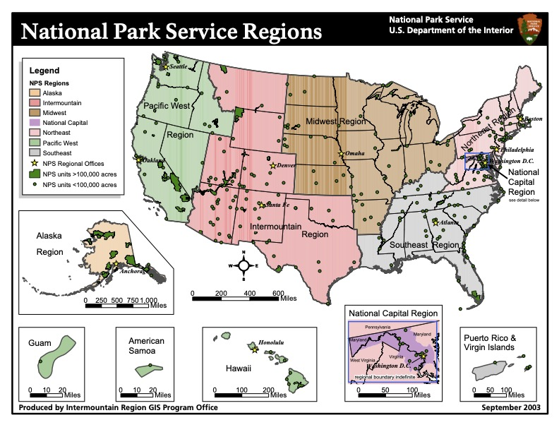

# Executive Summary

This project explores over a century of US National Park visitation data (1904–2016) to answer key questions about park popularity, regional trends, and route optimization. The study:
	•	Explores visitation trends over time.
	•	Analyzes patterns by region and state.
	•	Maps park locations and visualizes visitation intensity.
	•	Performs distance analyses to consider travel logistics.
	•	Clusters parks and uses the Traveling Salesman Problem (TSP) framework to suggest efficient multi-park itineraries.

The findings can help guide travel planning decisions, whether for a single park visit or a multi-park road trip.

## Introduction

Understanding patterns in national park visitation can provide insights into tourism trends, inform infrastructure planning, and help individuals optimize travel plans. In this project, I combine traditional data exploration with spatial analytics and route optimization to provide actionable insights for park visitors.

Data Preparation and Setup

Below we load the necessary libraries, import the dataset, and perform initial cleaning.

```{r setup, include=FALSE}
knitr::opts_chunk$set(echo = TRUE)

library(dplyr)
library(tidyr)
library(knitr)
library(stringr)
library(readr)

library(ggplot2)
library(httr)
library(jsonlite)
library(sf)
library(scales)
library(usmap)
library(geosphere)

library(TSP)
library(cluster)

library(gridExtra)
library(gganimate)
library(tinytex)
```

# Load and Clean Data

We start by importing the [visitation dataset](https://data.world/inform8n/us-national-parks-visitation-1904-2016-with-boundaries/workspace/file?filename=All+National+Parks+Visitation+1904-2016.csv) and removing problematic observations. In particular, we convert the YearRaw field to numeric (removing the “Total” rows) and omit rows with missing values.

```{r Add National Parks Visitor Data Set}

  ## Getting my Data Set
data <- read.csv("assets/Data Sources/US_NPS_Visitation/original/All National Parks Visitation 1904-2016.csv")

  ## Select key columns and remove missing values
data_clean <- select(data, Region:YearRaw) %>% 
  na.omit()

  ## Remove the "Total" rows and convert YearRaw to numeric
data_totals <- subset(data_clean, YearRaw == "Total")
data_clean <- subset(data_clean, YearRaw != "Total")
data_clean$YearRaw <- as.numeric(data_clean$YearRaw)
```


# Exploratory Analysis

National Park Visitation Trends

We aggregate the visitor counts by year and create a line plot to visualize the overall upward trend in national park visitation over time.

```{r Create a basic Line Plot of Total Visitation, echo=FALSE, out.width= 1000, warnings=FALSE}

sum_by_year <- aggregate(Visitors ~ YearRaw, data_clean, sum) 

p1 <- ggplot(data = sum_by_year, aes(x = YearRaw, y = Visitors)) +
  geom_line(size = 1, color = "blue", alpha = 0.8) + 
  scale_y_continuous(labels = scales::label_number(scale = 1e-6, suffix = "M")) +
  theme_minimal(base_size = 12) + 
  labs(
    title = "Total National Park Visitation per Year (1904-2016)",
    x = "Year",
    y = "Total Visitors (in Millions)"
  ) +
  theme(
    plot.title = element_text(face = "bold", hjust = 0.5, size = 14),
    axis.title.x = element_text(size = 12, margin = margin(t = 10)),
    axis.title.y = element_text(size = 12, margin = margin(r = 10)),
    axis.text = element_text(size = 10),
    panel.grid.major = element_line(color = "gray", size = 0.3), 
    panel.grid.minor = element_blank()
  )
p1

```

------------------------------------------------------------------------

{width=800 height=600}

\newpage

# Regional Analysis

The data set is subdivided into regions as shown in the info graphic above.

Next, we explore visitation by region. We filter for the regions of interest (Pacific West “PW”, Intermountain “IM”, and Midwest “MW”) and then visualize these trends in separate panels.

```{r regional-analysis, echo=TRUE}

# Group by Year and Region for selected regions
region_total <- data_clean %>%
  filter(Region %in% c("PW", "IM", "MW")) %>%
  group_by(YearRaw, Region) %>% 
  summarise(Total = sum(Visitors), .groups = "drop") %>%
  na.omit()

```

```{r regional-plot, echo=FALSE, warning=FALSE, out.width=800}

p2 <- ggplot(region_total, aes(x = YearRaw, y = Total, group = Region, color = Region)) +
  geom_line(size = 0.5, alpha = 0.8) +
  scale_y_continuous(labels = scales::label_number(scale = 1e-6, suffix = "M")) +
  theme_minimal(base_size = 12) +
  labs(
    title = "Regional National Park Visitation per Year (1904-2016)",
    x = "Year",
    y = "Total Visitors (in Millions)"
  ) +
  facet_wrap(~ Region, ncol = 3) +
  theme(
    strip.text = element_text(size = 12, face = "bold", color = "darkblue"),
    legend.position = "bottom",
    plot.title = element_text(face = "bold", hjust = 0.5, size = 14),
    axis.text.x = element_text(angle = 45, hjust = 1, size = 9)
  )
p2

```

------------------------------------------------------------------------

# State-Level Analysis and Mapping

We further examine visitation totals by state. We then merge state-level visitor data with geographic data to create a heatmap of visitation across selected western US states.

## Prepare State Data and Map

```{r state-prep}

# Aggregate visitation by state for selected states
state_data <- data_clean %>%
  group_by(State) %>%
  summarise(Total = sum(Visitors)) %>%
  filter(State %in% c("WA", "OR", "CA", "MT", "WY", 
                      "CO", "UT", "NV", "ND", "SD", 
                      "NE", "ID", "AZ", "NM"))

# Get map data for the states
states_map <- usmap::us_map(regions = "states") %>%
  filter(abbr %in% unique(state_data$State))

# Merge visitor data with map data
merged_data <- merge(states_map, state_data, by.x = "abbr", by.y = "State", all.x = TRUE)

```

------------------------------------------------------------------------

```{r state-map, echo=FALSE}

p3 <- ggplot() +
  geom_sf(data = merged_data, aes(fill = Total), color = "black", size = 0.2) +
  scale_fill_continuous(
    labels = scales::comma, 
    low = "white", 
    high = "red", 
    name = "All Time Visits", 
    na.value = "gray"
  ) +
  theme_minimal() +
  labs(
    title = "Heatmap of Total National Park Visits",
    subtitle = "by Selected Western US States",
    x = "Longitude",
    y = "Latitude"
  ) +
  theme(
    legend.position = "right",
    plot.title = element_text(face = "bold", hjust = 0.5, size = 16)
  )
p3

```
# Bubble Plot for Top Parks

Based on visitation totals, we extract the top parks and merge with pre-collected geographic coordinates. This enables us to produce a bubble plot overlaid on a US map.

```{r top-parks-prep, warning=FALSE}

# Aggregate visitation by park for selected states
top_parks <- data_clean %>%
  group_by(Unit.Name, State) %>%
  summarise(Total = sum(Visitors), .groups = "drop") %>%
  arrange(desc(Total)) %>%
  filter(State %in% c("WA", "OR", "CA", "MT", "WY", 
                      "CO", "UT", "NV", "ND", "SD", 
                      "NE", "ID", "AZ", "NM"))

# Load external geographic coordinates (ensure the file path is correct)
geo_data <- read_csv("~/Documents/GitHub/National_Parks_Project/assets/Data Sources/geo_data_processed.txt", 
                     col_types = cols(Lat = col_number(), Long = col_number()))

# Merge coordinate data with top parks
top_parks_merged <- merge(top_parks, geo_data, 
                          by.x = "Unit.Name", by.y = "Park Name")
top_parks_rearranged <- select(top_parks_merged, Unit.Name, State.x, Total, Longitude, Latitude)

```


```{r bubble-plot, echo=FALSE}

# Convert to spatial format
top_parks_rearranged_sf <- st_as_sf(top_parks_rearranged, 
                                    coords = c("Longitude", "Latitude"), 
                                    crs = 4326)

# Create base map layer using the usmap data
states_to_include <- c("WA", "OR", "CA", "MT", "WY", "CO", 
                       "UT", "NV", "ND", "SD", "NE", "ID", "AZ", "NM")
states_map <- usmap::us_map(regions = "states") %>%
  filter(abbr %in% states_to_include)

base_map <- ggplot() +
  geom_sf(data = states_map, fill = "white", color = "black") +
  theme_minimal() +
  labs(title = "Western United States National Parks",
       subtitle = "All Time Visitation")

# Overlay bubbles for park visitation
bubble_plot <- base_map +
  geom_sf(data = top_parks_rearranged_sf, 
          aes(size = Total), 
          fill = "dodgerblue3", 
          color = "blue", 
          alpha = 0.6, 
          shape = 21) + 
  scale_size_continuous(
    name = "Total Visitors", 
    labels = scales::label_number(big.mark = ","),
    range = c(1, 8)
  ) +
  labs(title = "Western United States National Parks",
       subtitle = "All Time Visitation") +
  theme(legend.position = "bottom",
        plot.title = element_text(face = "bold", size = 18, hjust = 0.5))
bubble_plot

```

------------------------------------------------------------------------

# Distance Analysis

To plan efficient travel routes, it is important to consider distances. Here we:
	1.	Define a home location (Helena, MT).
	2.	Use the OSRM API to obtain route geometries from home to each top park.
	3.	Calculate route distances.

## Obtain and Calculate Routes

```{r distance-analysis}

# Define home coordinates for Helena, MT
helena_coords <- data.frame(Latitude = 46.5891, Longitude = -112.0372)
helena_sf <- st_as_sf(helena_coords, coords = c("Longitude", "Latitude"), crs = 4326)

# Prepare the top parks data for routing
top_parks_merged_sf <- st_as_sf(top_parks_merged, 
                                coords = c("Longitude", "Latitude"), 
                                crs = 4326)

# Define a function to get route coordinates from OSRM
get_route <- function(start, end) {
  url <- paste0(
    "http://router.project-osrm.org/route/v1/driving/",
    start["lon"], ",", start["lat"], ";",
    end["Longitude"], ",", end["Latitude"],
    "?overview=full&geometries=geojson"
  )
  
  response <- httr::GET(url)
  route <- jsonlite::fromJSON(content(response, "text", encoding = "UTF-8"))
  route_coords <- route$routes$geometry$coordinates[[1]]
  route_coords_df <- data.frame(
    lon = route_coords[, 1],
    lat = route_coords[, 2]
  )
  return(route_coords_df)
}

# Set starting point (Helena, MT)
start <- c(lat = 46.5891, lon = -112.0372)

# Get routes from Helena to each park
routes_list <- lapply(1:nrow(top_parks_merged), function(i) {
  end <- top_parks_merged[i, ]
  route_df <- get_route(start, end)
  route_df$park <- top_parks_merged$Unit.Name[i]
  return(route_df)
})

all_routes <- do.call(rbind, routes_list)

# Calculate total distance (in miles) for each route using the Vincenty formula
meters_to_miles <- 1609.34
calculate_total_distance_miles <- function(df) {
  df$lon <- as.numeric(df$lon)
  df$lat <- as.numeric(df$lat)
  coords <- as.matrix(df[, c("lon", "lat")])
  distances <- distVincentySphere(coords[1:(nrow(coords) - 1), ], coords[2:nrow(coords), ])
  total_distance_meters <- sum(distances)
  total_distance_miles <- total_distance_meters / meters_to_miles
  return(total_distance_miles)
}

total_distances_miles <- sapply(routes_list, calculate_total_distance_miles)

# Attach distance information to each route
routes_list <- Map(function(df, dist) {
  df$total_distance_miles <- dist
  return(df)
}, routes_list, total_distances_miles)

all_routes <- bind_rows(routes_list)

```

# Visualize Routes

```{r plot-routes, echo=FALSE}

route_sf <- st_as_sf(all_routes, coords = c("lon", "lat"), crs = 4326)

p_routes <- base_map +
  geom_sf(
    data = route_sf, 
    aes(color = total_distance_miles), 
    size = 0.1,
    alpha = 0.8
  ) +
  labs(
    title = "Routes from Helena, MT to National Parks",
    subtitle = "Distances visualized with a color gradient",
    x = "Longitude", 
    y = "Latitude",
    color = "Distance (miles)"
  ) +
  scale_color_viridis_c() +
  theme_minimal(base_size = 10)
p_routes
```

------------------------------------------------------------------------

# Clustering and Route Optimization

With many nearby parks, it may be more efficient to plan a multi-park trip. We use hierarchical clustering to group parks by geographic proximity, then apply the Traveling Salesman Problem (TSP) algorithm to suggest the optimal visiting order within each cluster.

## Cluster Parks

```{r clustering, message=FALSE}

# For clustering, we work with the top parks data with coordinates
top_parks_cluster <- top_parks_merged

# Define a helper function to compute pairwise distances (in kilometers)
calculate_distance <- function(lat1, lon1, lat2, lon2) {
  distVincentySphere(c(lon1, lat1), c(lon2, lat2)) / 1000
}

# Create a distance matrix between parks
num_parks <- nrow(top_parks_cluster)
distance_matrix <- matrix(0, nrow = num_parks, ncol = num_parks)
rownames(distance_matrix) <- top_parks_cluster$Unit.Name
colnames(distance_matrix) <- top_parks_cluster$Unit.Name

for (i in 1:num_parks) {
  for (j in 1:num_parks) {
    if (i != j) {
      distance_matrix[i, j] <- calculate_distance(
        top_parks_cluster$Latitude[i],
        top_parks_cluster$Longitude[i],
        top_parks_cluster$Latitude[j],
        top_parks_cluster$Longitude[j]
      )
    }
  }
}

# Perform hierarchical clustering
dist_matrix <- dist(top_parks_cluster[, c('Longitude', 'Latitude')])
clusters <- hclust(dist_matrix)
park_clusters <- cutree(clusters, k = 5)
top_parks_cluster$cluster <- park_clusters

```

```{r plot-clusters, echo=FALSE}

# Convert to spatial data and visualize clusters
top_parks_cluster_sf <- st_as_sf(top_parks_cluster, coords = c("Longitude", "Latitude"), crs = 4326)

p_clusters <- base_map +
  geom_sf(data = top_parks_cluster_sf, 
          aes(color = factor(cluster)), 
          size = 2, 
          alpha = 0.9) +
  scale_color_brewer(palette = "Set1") +
  labs(title = "Cluster Analysis of National Parks",
       x = "Longitude", 
       y = "Latitude") +
  theme_minimal() +
  theme(plot.title = element_text(size = 16, face = "bold", hjust = 0.5),
        legend.position = "none")
p_clusters

```

------------------------------------------------------------------------

</div>
<div id="cluster_parks_tsp">

 Now we want to know what the most efficient way to drive from park to park is so we will use the Traveling Salesman Problem (TSP). The TSP finds shortest possible route that visits each city exactly once and returns to the original city.

```{r TSP}

  ## Initialize an empty list to store results
tsp_results <- list()

  ## Loop through each cluster
for (i in 1:max(top_parks_cluster$cluster)) {
    ## Subset parks for the current cluster
  cluster_parks <- top_parks_cluster[top_parks_cluster$cluster == i, ]
  
    ## Calculate the distance matrix for the current cluster
  dist_matrix <- as.dist(distm(cluster_parks[, c("Longitude", "Latitude")], 
                               cluster_parks[, c("Longitude", "Latitude")], 
                               fun = distHaversine))
  
    ## Solve the TSP problem using the nearest neighbor heuristic
  tsp_solution <- solve_TSP(TSP(dist_matrix), method = "nearest_insertion")
  
    ## Solution List
  tsp_results[[paste("Cluster", i)]] <- tsp_solution
}

```

```{r A Function to create the Segments of the Traveling Sales Person Model}

  ## Function to create segments from the TSP solution
get_tsp_segments <- function(cluster_number, top_parks_cluster, tsp_results) {
  
  ## Filter the parks by the selected cluster
  selected_cluster <- filter(top_parks_cluster, cluster == cluster_number)
  
  ## Retrieve the TSP order for the cluster
  tsp_order <- tsp_results[[paste("Cluster", cluster_number)]]
  print(tsp_order)
  tsp_solution_order <- TOUR(tsp_order)
  
  ## Order the parks according to the TSP solution
  ordered_cluster <- selected_cluster[tsp_solution_order, ]
  
  ## Close the loop by returning to the starting point
  ordered_cluster <- rbind(ordered_cluster, ordered_cluster[1, ])
  
  ## Create segments for each leg of the TSP path
  segments <- data.frame(cluster = cluster_number,
                         x = ordered_cluster$Longitude[-nrow(ordered_cluster)], 
                         y = ordered_cluster$Latitude[-nrow(ordered_cluster)], 
                         xend = ordered_cluster$Longitude[-1], 
                         yend = ordered_cluster$Latitude[-1]
                         )
  
  return(segments)
}

  ## Call the function
all_segments <- lapply(1:max(top_parks_cluster$cluster), function(cluster_num) {
  get_tsp_segments(cluster_num, top_parks_cluster, tsp_results)
})

## Combine all segments into one data frame
all_segments_df <- do.call(rbind, all_segments)


```
Next, we use the OSRM API to get detailed route geometries for each segment and then visualize them on our base map.

```{r A function to get the route coordinates from OSRM, message=FALSE}

# Function to get route coordinates from OSRM
get_route_osrm <- function(start_lon, start_lat, end_lon, end_lat) {
  url <- paste0(
    "http://router.project-osrm.org/route/v1/driving/",
    start_lon, ",", start_lat, ";", 
    end_lon, ",", end_lat, 
    "?overview=full&geometries=geojson"
  )
  
  response <- GET(url)
  route <- fromJSON(content(response, "text", encoding = "UTF-8"))
  
  route_coords <- route$routes$geometry$coordinates[[1]]
  route_coords_df <- data.frame(
    lon = route_coords[, 1],
    lat = route_coords[, 2]
  )
  return(route_coords_df)
}

# Apply the function to each row in the data frame
routes_list_cluster <- lapply(1:nrow(all_segments_df), function(i) {
  start_lon <- all_segments_df$x[i]
  start_lat <- all_segments_df$y[i]
  end_lon <- all_segments_df$xend[i]
  end_lat <- all_segments_df$yend[i]
  
  route <- get_route_osrm(start_lon, start_lat, end_lon, end_lat)
  
  route_df <- data.frame(id = i, cluster =all_segments_df$cluster[i], route)
  
  return(route_df)
})

# Combine all route data frames into one
all_cluster_routes_df <- do.call(rbind, routes_list_cluster)

# Create an sf object from the combined data frame
routes_sf <- st_as_sf(all_cluster_routes_df, coords = c("lon", "lat"), crs = 4326, agr = "constant")

routes_sf_lines <- routes_sf %>%
  group_by(id, cluster) %>%
  summarize(geometry = st_combine(geometry)) %>%
  st_cast("LINESTRING")

```
------------------------------------------------------------------------

```{r Plot 8, echo=FALSE}

# Create the plot
p8 <- base_map +
  geom_sf(data = routes_sf_lines, 
          color = "black", 
          size = .5,  
          linetype = "solid", 
          arrow = arrow(type = "open", length = unit(0.02, "inches"))) + 
  geom_sf(data = routes_sf_lines, 
          aes(color = as.factor(cluster)), 
          size = 0.2, 
          linetype = "solid", 
          arrow = arrow(type = "open", length = unit(0.015, "inches"))) + 
  scale_color_brewer(palette = "Set1") +
  labs(title = "Traveling Salesman Route Optimization",
       subtitle = "Visiting Clustered Parks",
       x = "Longitude", 
       y = "Latitude",
       color = "Cluster") +
  theme_minimal(base_size = 14) + 
  theme(legend.position = "none",
        plot.title = element_text(size = 16, face = "bold", hjust = 0.5),
        plot.subtitle = element_text(size = 12, hjust = 0.5),
        panel.background = element_rect(fill = "white", color = "white")) + 
  coord_sf()  

# Print the plot
print(p8)

```

------------------------------------------------------------------------

# Conclusion

This portfolio project demonstrates a full workflow for transforming raw visitation data into actionable insights:
	•	Temporal and regional analyses reveal long-term trends and popular areas.
	•	Spatial visualizations help pinpoint high-traffic parks.
	•	Route optimization via clustering and TSP supports efficient multi-park trip planning.

These methods can be further extended or tailored for specific travel planning applications or more granular analyses of park visitor data.


# Next Steps

## Future work might include:
	•	Refining clustering parameters and TSP heuristics.
	•	Incorporating real-time traffic data into route optimization.
	•	Developing an interactive dashboard for dynamic travel planning.

```{r more TSP}

# Function to calculate approximate distance between two points
calculate_distance <- function(lat1, lon1, lat2, lon2) {
  distVincentySphere(c(lon1, lat1), c(lon2, lat2)) / 1000  # Convert meters to kilometers
}

perform_hierarchical_clustering <- function(df) {
  num_parks <- nrow(df)

  # Create an empty distance matrix
  distance_matrix <- matrix(0, nrow = num_parks, ncol = num_parks, 
                            dimnames = list(1:num_parks, 1:num_parks))
  
  # Populate the distance matrix
  for (i in 1:num_parks) {
    for (j in 1:num_parks) {
      if (i != j) {
        lat1 <- df$Latitude[i]
        lon1 <- df$Longitude[i]
        lat2 <- df$Latitude[j]
        lon2 <- df$Longitude[j]
        distance <- calculate_distance(lat1, lon1, lat2, lon2)
        distance_matrix[i, j] <- distance
      }
    }
  }
  
# Convert the distance matrix to a dist object for hierarchical clustering
  dist_matrix <- as.dist(distance_matrix)
  
  # Perform hierarchical clustering using Ward's method
  hc <- hclust(dist_matrix, method = "ward.D2")
  
  # Determine the number of clusters (example: sqrt of the number of rows)
  num_clusters <- max(nrow(df)/5, 1)
  
  # Cut the dendrogram to create the clusters
  clusters <- cutree(hc, k = num_clusters)
  
    # Add cluster assignments to the original data frame
  df$subcluster <- clusters

  return(list(hc = hc, clusters = clusters, df_with_clusters = df))
}

# Initialize a list to store results for each cluster
cluster_results_list <- list()

# Loop through each cluster (assuming clusters are numbered from 1 to 5)
for (i in 1:5) {
  # Filter the data frame for the current cluster
  filtered_top_parks_cluster <- top_parks_cluster %>% filter(cluster == i)
  
  # Perform hierarchical clustering on the filtered data
  result <- perform_hierarchical_clustering(filtered_top_parks_cluster)
  
    # Store the result in the list with a named entry
  cluster_results_list[[paste("Cluster", i)]] <- result
}

# View dendrograms and clusters for each result
for (i in 1:length(cluster_results_list)) {
  result <- cluster_results_list[[i]]
  
  if (!is.null(result$hc)) {
    # Plot dendrogram
    plot(result$hc, main = paste("Dendrogram for Cluster", i))
    
    # Print cluster assignments
    print(result$clusters)
  } else {
    print(paste("No clustering performed for cluster", i))
  }
}


```

</div>
<div id="subcluster_parks_tsp">


```{r TSP 2.0}


# Function to create segments from the TSP solution
get_tsp_segments_subclusters <- function(cluster_number, subcluster_number, cluster_parks_subcluster, tsp_results) {
  
  # Filter the parks by the selected subcluster
  selected_cluster <- filter(cluster_parks_subcluster, subcluster == subcluster_number)
  
  # Retrieve the TSP order for the subcluster
  tsp_order <- tsp_results[[paste("cluster", i, "subcluster", j)]]
  print(tsp_order)
  
  tsp_solution_order <- TOUR(tsp_order)
  
  # Order the parks according to the TSP solution
  ordered_cluster <- selected_cluster[tsp_solution_order, ]
  
  # Close the loop by returning to the starting point
  ordered_cluster <- rbind(ordered_cluster, ordered_cluster[1, ])
  
  # Create segments for each leg of the TSP path
  segments <- data.frame(
    subcluster = subcluster_number,
    x = ordered_cluster$Longitude[-nrow(ordered_cluster)], 
    y = ordered_cluster$Latitude[-nrow(ordered_cluster)], 
    xend = ordered_cluster$Longitude[-1], 
    yend = ordered_cluster$Latitude[-1]
  )
  
  return(segments)
}

# Initialize an empty list to store results
tsp_results <- list()

# Initialize an empty list to store all segments for subclusters
all_segments_subclusters <- list()

# Loop through each cluster
for (i in 1:5) {
  cluster_parks <- cluster_results_list[[i]] 
  
  for (j in 1:max(cluster_parks$clusters)) {
    # Subset parks for the current subcluster
    cluster_parks_subcluster <- cluster_parks$df_with_clusters
    
    filtered_cluster_parks <- filter(cluster_parks_subcluster, subcluster == j)
    
    # Calculate the distance matrix for the current subcluster
    dist_matrix <- as.dist(distm(filtered_cluster_parks[, c("Longitude", "Latitude")], 
                                 filtered_cluster_parks[, c("Longitude", "Latitude")], 
                                 fun = distHaversine))
    
    # Solve the TSP problem using the nearest neighbor heuristic
    tsp_solution <- solve_TSP(TSP(dist_matrix), method = "nearest_insertion")
    
    # Store the solution in the list
    tsp_results[[paste("cluster", i, "subcluster", j)]] <- tsp_solution
    
    # Create segments for the TSP path
    segments <- get_tsp_segments_subclusters(i, j, cluster_parks_subcluster, tsp_results)
    
    # Add cluster and subcluster identifiers as columns
    segments$cluster <- i
    segments$subcluster <- j
    
    all_segments_subclusters[[paste("cluster", i, "subcluster", j)]] <- segments
  }
}

# Combine all segments into one data frame
all_segments_subcluster_df <- do.call(rbind, all_segments_subclusters)

```

Now that I have the results, I can visualize what the optimal route is. In order to do that, I want to plot them all on the same map which will require creating a function to compile all the data points into one table.


```{r More Route Coordinates}

# Function to get route coordinates from OSRM
get_route_osrm <- function(start_lon, start_lat, end_lon, end_lat) {
  url <- paste0(
    "http://router.project-osrm.org/route/v1/driving/",
    start_lon, ",", start_lat, ";", 
    end_lon, ",", end_lat, 
    "?overview=full&geometries=geojson"
  )
  
  response <- GET(url)
  route <- fromJSON(content(response, "text", encoding = "UTF-8"))
  
  route_coords <- route$routes$geometry$coordinates[[1]]
  route_coords_df <- data.frame(
    lon = route_coords[, 1],
    lat = route_coords[, 2]
  )
  return(route_coords_df)
}

# Apply the function to each row in the data frame
routes_list_subcluster <- lapply(1:nrow(all_segments_subcluster_df), function(i) {
  start_lon <- all_segments_subcluster_df$x[i]
  start_lat <- all_segments_subcluster_df$y[i]
  end_lon <- all_segments_subcluster_df$xend[i]
  end_lat <- all_segments_subcluster_df$yend[i]
  
  route <- get_route_osrm(start_lon, start_lat, end_lon, end_lat)
  
  route_df <- data.frame(id = i, cluster = all_segments_subcluster_df$cluster[i], subcluster = all_segments_subcluster_df$subcluster[i], route)
  
  return(route_df)
})

# Combine all route data frames into one
all_subcluster_routes_df <- do.call(rbind, routes_list_subcluster)

# Create an sf object from the combined data frame
routes_subcluster_sf <- st_as_sf(all_subcluster_routes_df, coords = c("lon", "lat"), crs = 4326, agr = "constant")

routes_subcluster_sf_lines <- routes_subcluster_sf %>%
  group_by(id, cluster) %>%
  summarize(geometry = st_combine(geometry)) %>%
  st_cast("LINESTRING")

```


```{r Plot 9, echo=FALSE}

p <- base_map +
  geom_sf(data = routes_subcluster_sf_lines, 
          color = "black", 
          size = 1.5,
          linetype = "solid", 
          arrow = arrow(type = "open", length = unit(0.03, "inches"))) +
  geom_sf(data = routes_subcluster_sf_lines, 
          aes(color = as.factor(cluster)), 
          size = 0.7, 
          linetype = "solid", 
          arrow = arrow(type = "open", length = unit(0.02, "inches"))) + 
  scale_color_brewer(palette = "Set1") +
  labs(title = "Traveling Salesman Optimized Routes",
       subtitle = "Reclustering the original clusters",
       x = "Longitude",
       y = "Latitude",
       color = "Cluster") +
  theme_minimal(base_size = 14) +
  theme(legend.position = "none",
        plot.title = element_text(face = "bold", size = 16, hjust = 0.5),
        plot.subtitle = element_text(size = 12, hjust = 0.5),
        panel.background = element_rect(fill = "white", color = "white"))

print(p)

```


